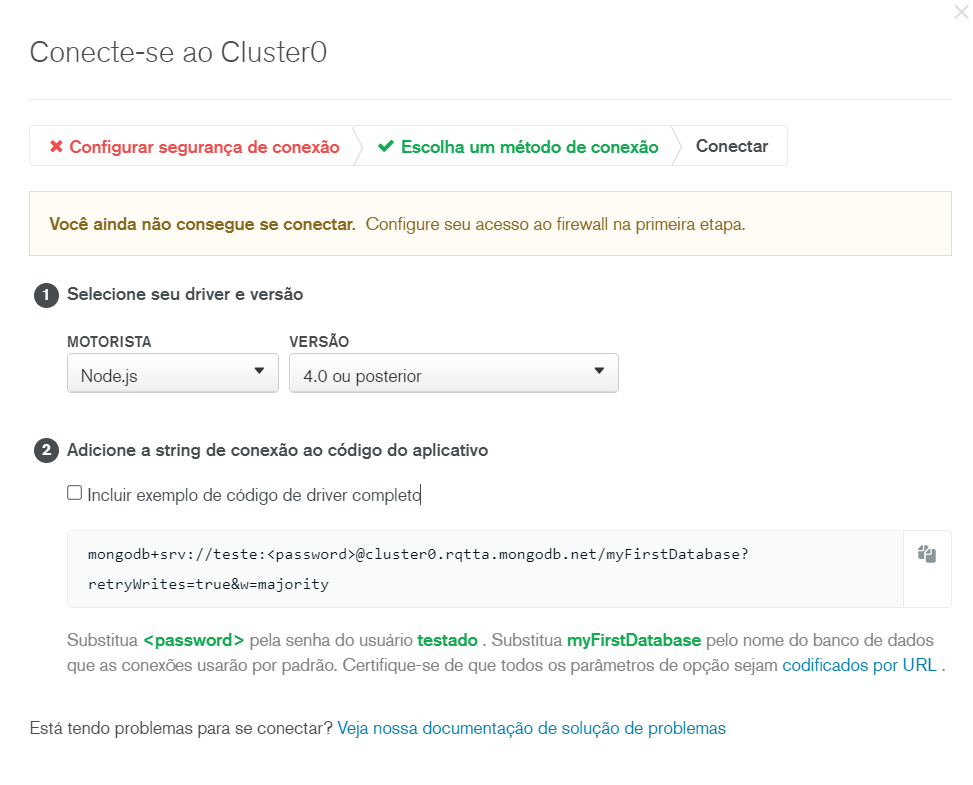

# url-shortneer-eduzz-dio
Url Shortneer resultante do projeto "Construindo Encurtador de URL" do Bootcamp da Eduzz em parceria com a Digital Innovation One. No projeto foi criado um encurtador de URL com o banco de dados Mongo DB em Cloud.

Abaixo temos a tela de configuração do Mongo DB Cloud criada durante o projeto. 

O passo seguinte foi modificar o valor do MONGO_CONNECTION presente no arquivo Constants.ts com o usuário e senha do banco criado.

